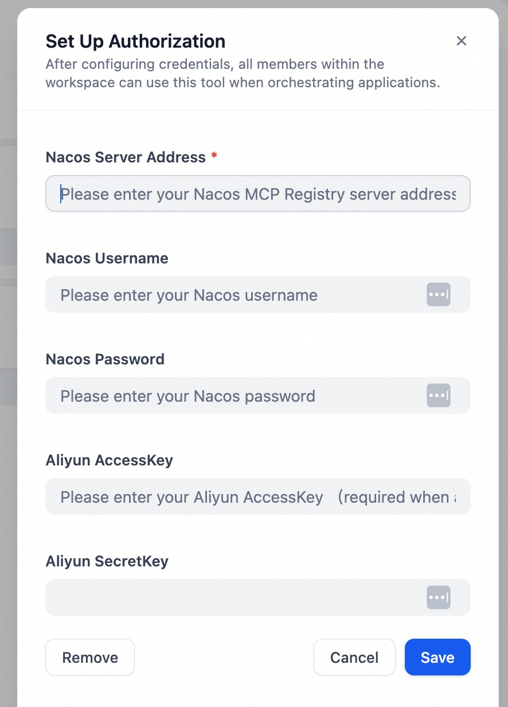
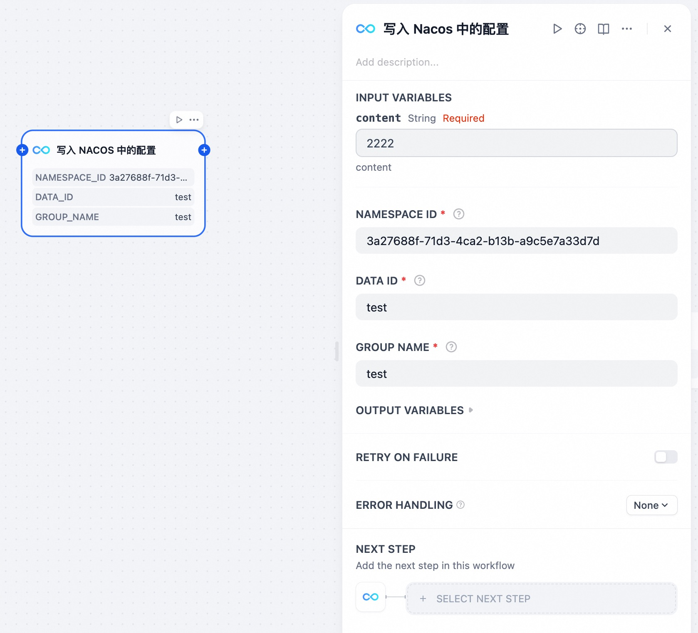
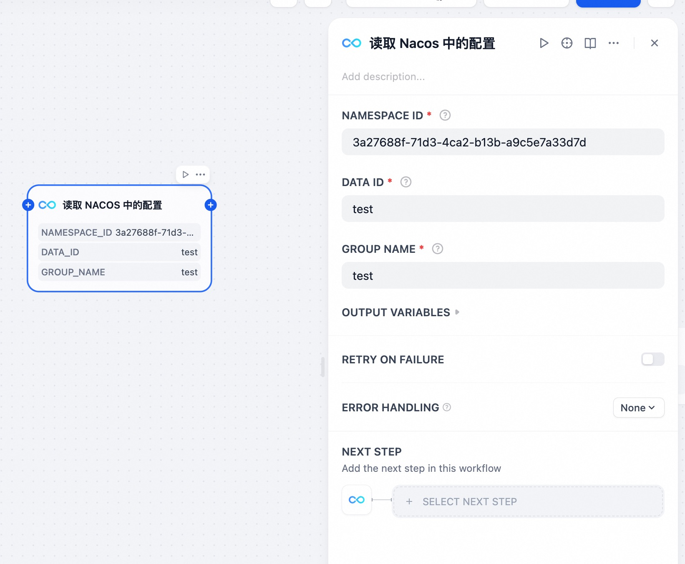

# Nacos Plugin

**Author:** [aias00](https://github.com/nacos-group/nacos-dify-plugins/nacos_config)
**Version:** 0.0.2
**Type:** tool

## Description

### Set up Authorization
Enter the Nacos Server address, username, and password to configure Nacos  plugin authentication.

### Nacos Config Writer Plugin

The Nacos Writer Plugin allows users to write data into Nacos.

### Features

- Write Config into Nacos and returns standard output and standard error

### Parameters

| Parameter        | Type | Required | Description |
|------------------|------|----------|-------------|
| namespace_id     | string | Yes | namespace of the Nacos server |
| data_id          | string | Yes | data_id of the Nacos server |
| group_name       | string | Yes | group of the Nacos server |
| content          | string | Yes | Content to write into Nacos |

### Nacos Config Reader Plugin

The Nacos Config Reader Plugin allows users to read data from Nacos.

### Features

- Read Config from Nacos and returns standard output and standard error

### Parameters

| Parameter    | Type | Required | Description |
|--------------|------|----------|-------------|
| namespace_id | string | Yes | namespace of the Nacos server |
| data_id      | string | Yes | data_id of the Nacos server |
| group_name   | string | Yes | group of the Nacos server |

## Security Considerations

- Ensure you have permission to access the target server
- Sensitive information such as private keys and passwords should be kept secure
- Follow the principle of least privilege, granting only necessary execution permissions

## License

[Apache 2.0](../LICENSE)

