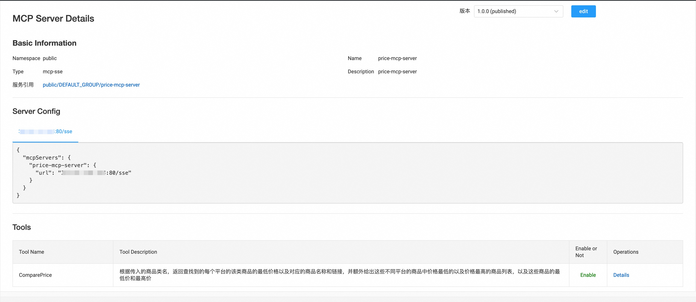
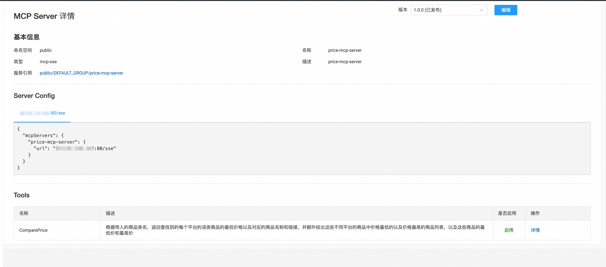
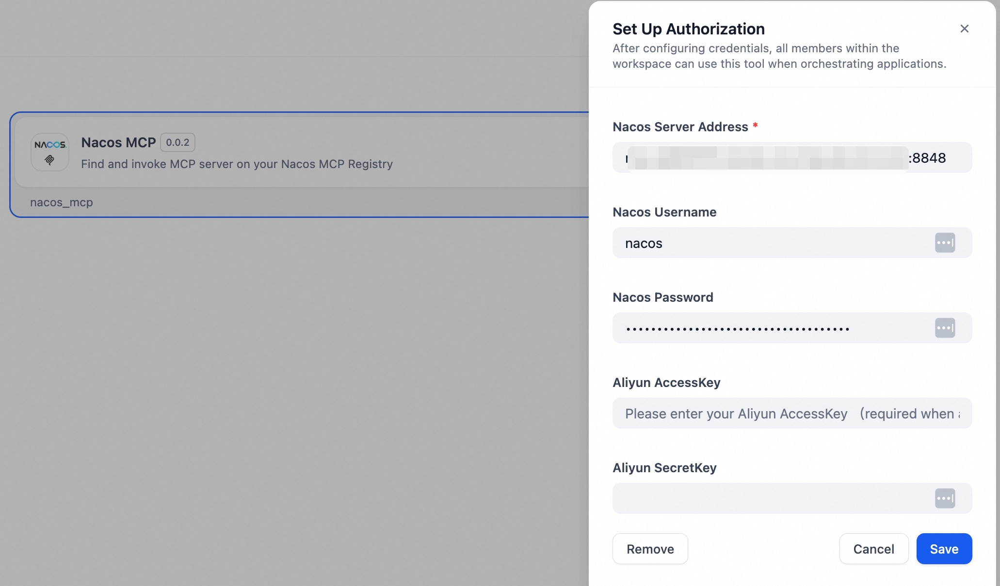
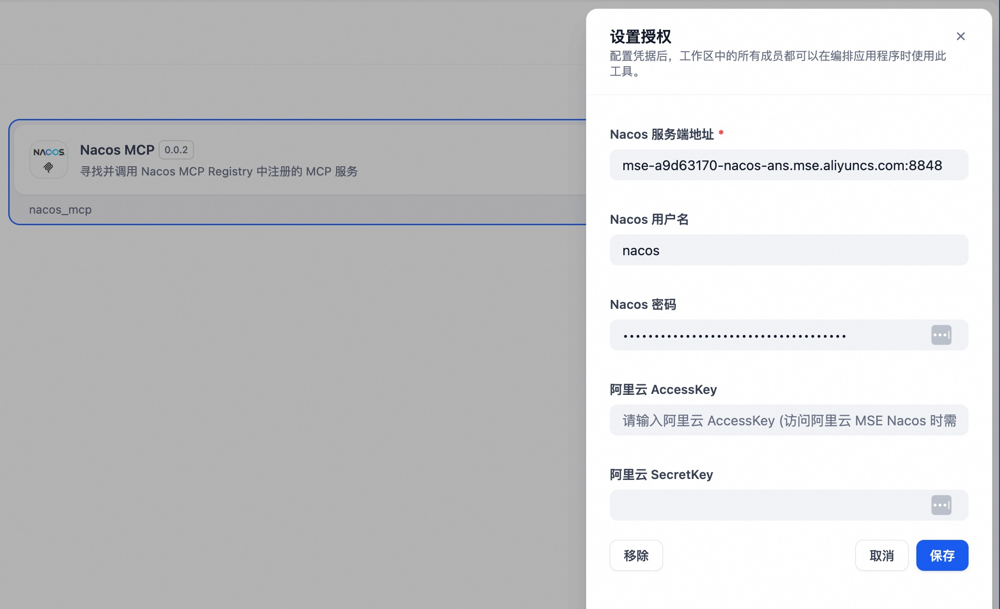
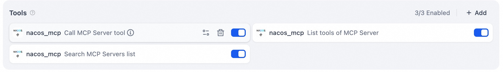
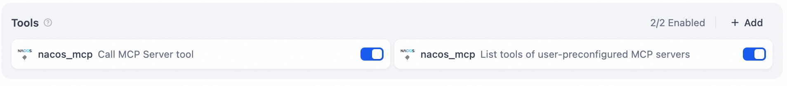
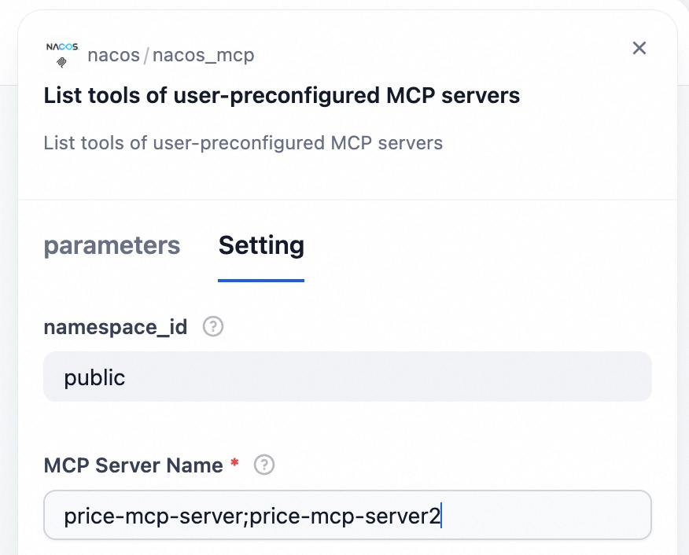
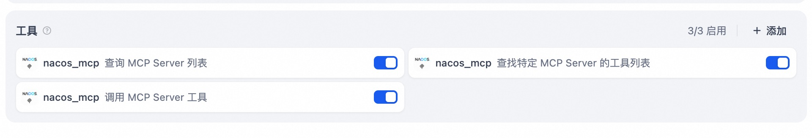
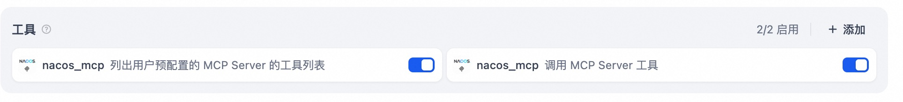

## Nacos MCP

**Author:** nacos
**Version:** 0.0.2
**Type:** tool

### Repository 仓库
https://github.com/nacos-group/nacos-dify-plugins/tree/main/nacos_mcp

### Description
Discover SSE/Streamable HTTP-type MCP Server services registered in Nacos and convert them into tool calls in Dify.

发现 Nacos 中注册的 SSE/Streamable Http 类型 MCP Server 服务并转化为 Dify 中的工具调用

### Step 1 Set up  MCP Server  in Nacos. 在 Nacos 中创建 MCP Server 服务

Create SSE/Streamable HTTP MCP Server in Nacos through manual
creation, [Spring AI Alibaba Mcp Nacos](https://github.com/alibaba/spring-ai-alibaba/tree/main/spring-ai-alibaba-mcp/spring-ai-alibaba-mcp-nacos)
automatic registration, and [Nacos MCP Wrapper Python](https://github.com/nacos-group/nacos-mcp-wrapper-python)
automatic registration. Requires Nacos version ≥ 3.0.1.

通过手动创建、[Spring AI Alibaba Mcp Nacos](https://github.com/alibaba/spring-ai-alibaba/tree/main/spring-ai-alibaba-mcp/spring-ai-alibaba-mcp-nacos)
自动注册、 [Nacos MCP Wrapper Python](https://github.com/nacos-group/nacos-mcp-wrapper-python) 自动注册等方式在 Nacos 中创建
SSE/Streamable Http 类型 MCP Server 服务，要求Nacos版本大于或等于3.0.1

### Step 2 Set Up Authorization. 设置授权
Enter the Nacos Server address, username, and password to configure Nacos MCP plugin authentication. The plugin will check connectivity with the Nacos Server.

输入Nacos Server 地址，用户名及密码，设置Nacos MCP 插件授权，插件会检查和Nacos Server之间的联通性。

### Step 3 Usage. 使用

The Nacos MCP plugin provides the following tools:

#### 1. Search MCP Servers list (`list_mcp_servers`)

Search for SSE/Streamable HTTP-type MCP Server services in Nacos based on the namespace and page number, and return the list. The namespace parameter is specified by the user.

#### 2. List tools of MCP Server (`list_mcp_server_tools`)

Return the list of available tools for a given MCP Server based on the namespace and the provided MCP Server name. The MCP Server name is automatically inferred by the model. The namespace parameter is specified by the user.

#### 3. List tools of user-preconfigured MCP servers (`list_mcp_server_tools_by_user`)

Return the list of available tools for a given MCP Server based on the namespace and the provided MCP Server name. The MCP Server name is manually specified by the user in advance. The namespace parameter is specified by the user.

#### 4. Call MCP Server tool (`call_mcp_tool`)

Invoke tools of the MCP Server based on the namespace, MCP Server name, tool name, and tool invocation parameters, and return the result of the invocation. The namespace parameter is specified by the user.

Users can use the Nacos MCP plugin in Dify in two ways:

If users want the model to automatically search for the list of MCP Servers in Nacos and automatically select an appropriate MCP Server, they can configure the model with **Query MCP Server List**, **Find Tool List of a Specific MCP Server**, and **Invoke MCP Server Tools**. The model will first query the list of MCP Servers, then select an appropriate MCP Server based on task requirements, query its corresponding tools, and invoke them.

If users want to manually specify which MCP Servers to import, they can configure **List Tools of User-Preconfigured MCP Servers** and **Invoke MCP Server Tools**. The model will first query the list of tools from the user-configured MCP Servers, then select the appropriate tool based on task requirements and invoke it.

In **List Tools of User-Preconfigured MCP Servers**, you need to enter the names of the MCP Servers in Nacos. Multiple MCP Servers are supported, separated by `;`.

Nacos MCP 插件提供有以下工具：

#### 1. 查询 MCP Server 列表 (`list_mcp_servers`)

根据命名空间和页号查找 Nacos 中 SSE/Streamable Http 类型 MCP Server 服务，并返回列表。命名空间参数由用户指定。

#### 2. 查找特定的 MCP Server 的工具列表 (`list_mcp_server_tools`)

根据命名空间以及输入的 MCP Server 名称，返回 MCP Server可用的工具列表，其中 MCP Server 的名称由模型自动推理得出。命名空间参数由用户指定

#### 3. 列出用户预配置的 MCP Server 的工具列表 (`list_mcp_server_tools_by_user`)

根据命名空间以及输入的 MCP Server 名称，返回 MCP Server可用的工具列表，其中 MCP Server 的名称由用户提前指定。命名空间参数由用户指定

#### 4. 调用 MCP Server 工具 (`call_mcp_tool`)

根据命名空间、MCP Server 名称、工具名称及工具调用的参数，调用 MCP Server 的工具，并返回调用的结果。命名空间参数由用户指定

用户可以通过以下两种方式在 Dify 中使用 Nacos MCP 插件

如果用户希望模型自动搜索 Nacos 中的 MCP Server 列表，并自动选择适合的 MCP Server，可以为模型配置 **查询 MCP Server 列表**，
**查找特定的 MCP Server 的工具列表**，以及**调用 MCP Server 工具**。模型会首先查询 MCP Server 列表，然后根据任务需求挑选合适的MCP
Server并查询对应的工具，并进行调用。

如果用户希望手动指定导入哪些MCP Server,可以配置 **列出用户预配置的 MCP Server 的工具列表**，以及**调用 MCP Server 工具**
。模型会首先查询用户配置的 MCP Server 列表的工具列表，然后根据任务需求挑选合适的工具，并进行调用。

其中需要在**列出用户预配置的 MCP Server 的工具列表**中填写 Nacos 中 MCP Server 的名字，支持配置多个 MCP Server, 多个 MCP
Server 之间以`;`进行分隔

### FAQ

#### Q: Authorization setup failed  
#### A: Ensure that the Nacos Server version is 3.0.1 or higher, and verify that the Nacos Server address, username, and password are correct. Pay attention to whether the port is correctly set — the default port for Nacos Server is 8848. Also, ensure network connectivity between Nacos Server and Dify.

#### Q: 设置授权失败
#### A: 请确保 Nacos Server 版本在 3.0.1 及以上，并检查 Nacos Server 地址、用户名及密码是否正确, 注意 Nacos Server 地址是否正确设置了端口，Nacos Server 默认端口为8848。确保 Nacos Server 和 Dify 之间的网络联通性。

#### Q: The model fails to find the correct MCP Server or invoke the correct tool  
#### A: Make sure the descriptions of the corresponding MCP Server and its tools in Nacos are accurate. Well-written descriptions help the model better identify and use the appropriate MCP Servers and tools.

#### Q: 模型无法找到正确的MCP Server 及调用正确的工具
#### A: 请确保 Nacos 中对应的 MCP Server 的描述及对应tools的描述准确。优秀的描述能够帮助模型更好的调用 MCP Server 及工具。

