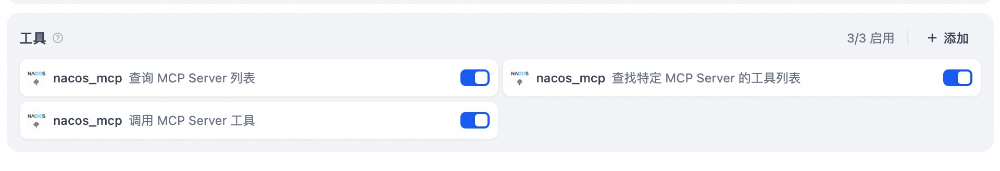
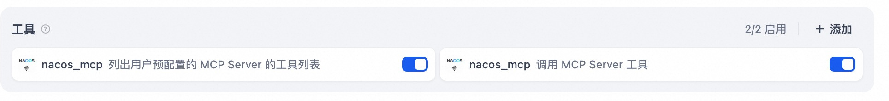
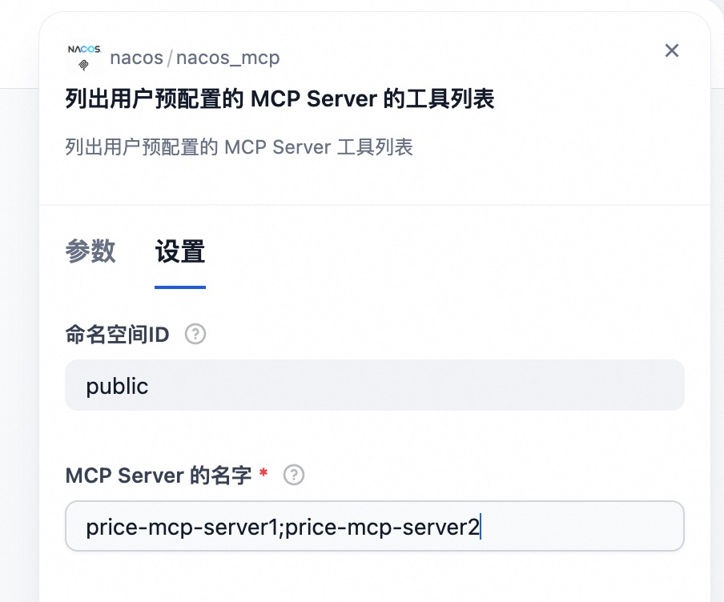

## Nacos MCP

**作者:** nacos  
**版本:** 0.0.5  
**类型:** tool

### 仓库
https://github.com/nacos-group/nacos-dify-plugins/tree/main/nacos_mcp

### 描述
发现 Nacos 中注册的 SSE/Streamable HTTP 类型 MCP Server 服务并转化为 Dify 中的工具调用。

### 步骤 1: 在 Nacos 中创建 MCP Server 服务

通过手动创建、[Spring AI Alibaba Mcp Nacos](https://github.com/alibaba/spring-ai-alibaba/tree/main/spring-ai-alibaba-mcp/spring-ai-alibaba-mcp-nacos) 自动注册、[Nacos MCP Wrapper Python](https://github.com/nacos-group/nacos-mcp-wrapper-python) 自动注册等方式在 Nacos 中创建 SSE/Streamable HTTP 类型 MCP Server 服务。要求 Nacos 版本 ≥ 3.0.1。

### 步骤 2: 设置授权

输入 Nacos Server 地址、用户名及密码，设置 Nacos MCP 插件授权。插件会检查和 Nacos Server 之间的联通性。

### 步骤 3: 使用

Nacos MCP 插件提供有以下工具：

#### 1. 查询 MCP Server 列表 (`list_mcp_servers`)

根据命名空间和页号查找 Nacos 中 SSE/Streamable HTTP 类型 MCP Server 服务，并返回列表。命名空间参数由用户指定。

#### 2. 查找特定的 MCP Server 的工具列表 (`list_mcp_server_tools`)

根据命名空间以及输入的 MCP Server 名称，返回 MCP Server 可用的工具列表，其中 MCP Server 的名称由模型自动推理得出。命名空间参数由用户指定。

#### 3. 列出用户预配置的 MCP Server 的工具列表 (`list_mcp_server_tools_by_user`)

根据命名空间以及输入的 MCP Server 名称，返回 MCP Server 可用的工具列表，其中 MCP Server 的名称由用户提前指定。命名空间参数由用户指定。

#### 4. 调用 MCP Server 工具 (`call_mcp_tool`)

根据命名空间、MCP Server 名称、工具名称及工具调用的参数，调用 MCP Server 的工具，并返回调用的结果。命名空间参数由用户指定。

### 使用模式

用户可以通过以下两种方式在 Dify 中使用 Nacos MCP 插件：

**模式 1: 自动发现 MCP Server**

如果用户希望模型自动搜索 Nacos 中的 MCP Server 列表，并自动选择适合的 MCP Server，可以为模型配置 **查询 MCP Server 列表**、**查找特定的 MCP Server 的工具列表**，以及 **调用 MCP Server 工具**。模型会首先查询 MCP Server 列表，然后根据任务需求挑选合适的 MCP Server 并查询对应的工具，并进行调用。

**模式 2: 手动配置 MCP Server**

如果用户希望手动指定导入哪些 MCP Server，可以配置 **列出用户预配置的 MCP Server 的工具列表**，以及 **调用 MCP Server 工具**。模型会首先查询用户配置的 MCP Server 列表的工具列表，然后根据任务需求挑选合适的工具，并进行调用。

其中需要在 **列出用户预配置的 MCP Server 的工具列表** 中填写 Nacos 中 MCP Server 的名字，支持配置多个 MCP Server，多个 MCP Server 之间以 `;` 进行分隔。

### 常见问题

#### Q: 设置授权失败
**A:** 请确保 Nacos Server 版本在 3.0.1 及以上，并检查 Nacos Server 地址、用户名及密码是否正确。注意 Nacos Server 地址是否正确设置了端口，Nacos Server 默认端口为 8848。确保 Nacos Server 和 Dify 之间的网络联通性。

#### Q: 模型无法找到正确的 MCP Server 及调用正确的工具
**A:** 请确保 Nacos 中对应的 MCP Server 的描述及对应 tools 的描述准确。优秀的描述能够帮助模型更好的调用 MCP Server 及工具。
